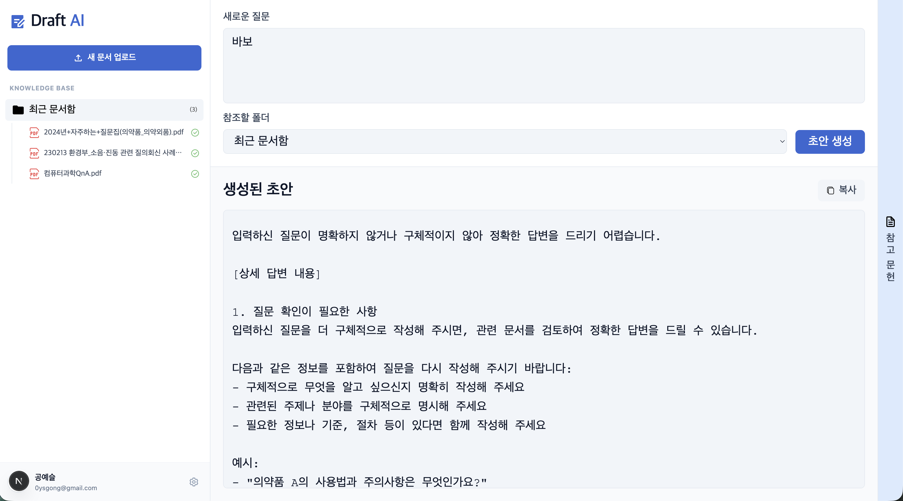
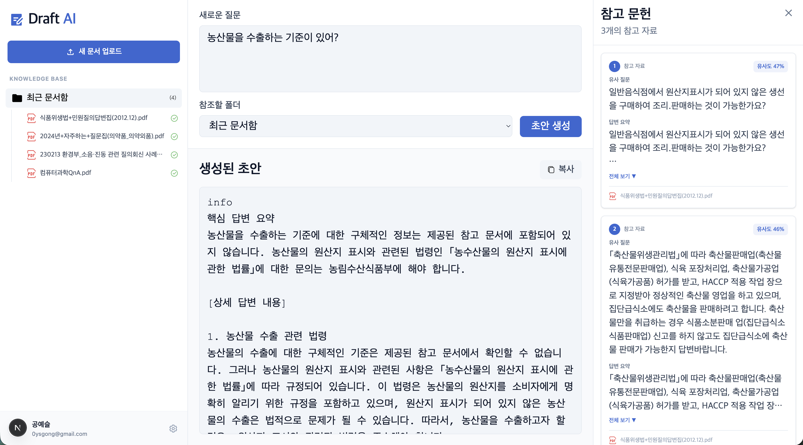
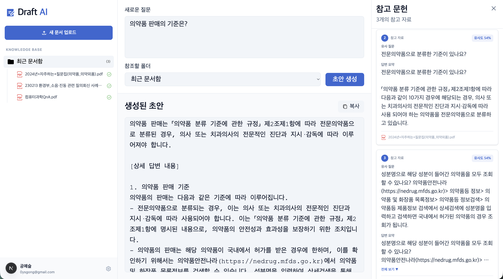
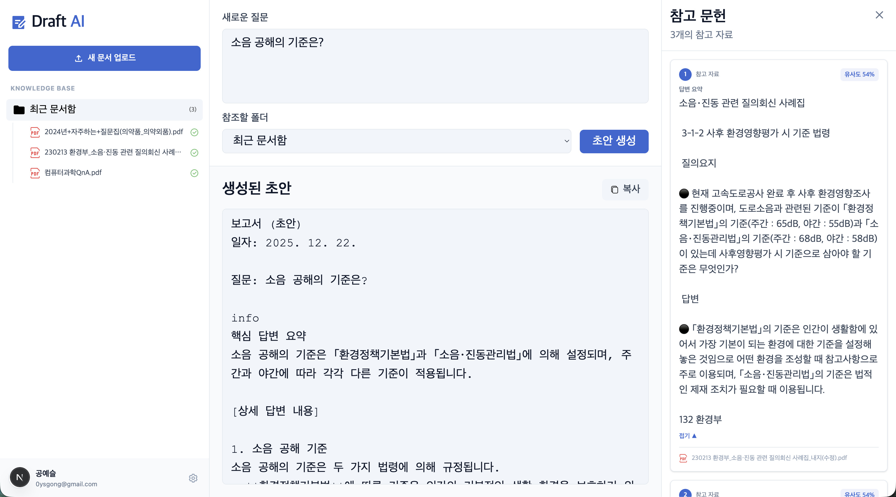

# 🚀 Draft AI: RAG 기반 지식 문서 초안 작성 도구

> PDF 문서를 업로드하고, AI가 문서 내용을 이해하여 질문에 대한 정확한 초안을 자동으로 생성합니다.
> 법률, 의료, 기술 문서 등 전문 분야의 문서 작성을 획기적으로 간소화합니다.

---

## 📸 UI Preview

이 프로젝트의 주요 인터페이스를 한눈에 보여줍니다.

| 질문 구체화 (RAG) | 참조 문서 참고 RAG |
| :---: | :---: |
|  |  |
| *부정확한 질문에 대한 개선 제안* | *참조 문서를 기반으로 한 정확한 답변* |

### 전문 분야 응답 예시

| 의료 분야 | 법 분야 |
| :---: | :---: |
|  |  |
| *의료 문서 기반 전문 답변* | *법률 문서 기반 전문 답변* |

---

## ✨ Key Features (주요 기능)

### 1. 🤖 RAG 기반 초안 생성
* **지식 기반 답변:** 업로드한 PDF 문서들을 벡터 데이터베이스에 인덱싱하여 정확한 답변 생성
* **폴더별 검색:** 폴더 단위로 문서를 관리하고, 특정 폴더의 문서만 참조하여 답변 생성
* **질문 구체화:** 모호하거나 부정확한 질문에 대해 AI가 더 구체적인 질문을 제안 (예: `dump_example.png`)
* **다중 문서 통합:** 여러 PDF 문서의 정보를 통합하여 종합적인 답변 제공

### 2. 📚 스마트 문서 관리
* **폴더 구조:** 계층적 폴더 구조로 문서를 체계적으로 관리
* **자동 인덱싱:** 업로드된 PDF 문서를 자동으로 파싱하고 벡터 인덱스 구축
* **배치 처리:** 3분마다 자동으로 대기 중인 문서들을 배치 인덱싱 (최대 5개씩)
* **상태 추적:** 문서 인덱싱 상태를 실시간으로 확인 (uploaded → processing → completed/failed)

### 3. 🎨 직관적인 UI/UX
* **실시간 편집:** 생성된 초안을 마크다운 에디터에서 실시간으로 수정 가능
* **증거 추적:** 각 답변의 출처 문서와 관련 청크를 명확히 표시
* **Google OAuth:** 간편한 Google 계정 로그인으로 사용자 인증
* **반응형 디자인:** 모던한 UI로 모든 디바이스에서 최적의 경험 제공

### 4. 🔍 고성능 검색 시스템
* **LlamaParse:** 고품질 PDF 파싱으로 문서 구조 보존
* **pgvector:** PostgreSQL의 벡터 확장을 활용한 빠른 유사도 검색
* **MarkdownElementNodeParser:** 질문-답변 쌍을 유지하며 청크 분할
* **상위 K개 참조:** 관련성 높은 상위 3개 청크를 참조하여 정확한 답변 생성

---

## 🛠 Tech Stack (기술 스택)

| Category | Tech Stack |
| :--- | :--- |
| **Frontend** | Next.js 14, React 18, TypeScript, Tailwind CSS, Emotion |
| **Backend** | FastAPI, Python 3.10+ |
| **AI/ML** | OpenAI GPT-4o-mini, LlamaIndex, LlamaParse |
| **Database** | Supabase (PostgreSQL + pgvector) |
| **Authentication** | Google OAuth 2.0, JWT |

---

## 🚀 Getting Started (시작하기)

프로젝트를 로컬 환경에서 실행하는 방법입니다.
vscode 환경 권장합니다.

### Prerequisites
* Node.js 18.18.0 이상
* Python 3.10 이상
* API Keys:
  - OpenAI API Key
  - LlamaCloud API Key (LlamaParse 사용)
  - Supabase URL 및 Service Key
  - Google OAuth Client ID 및 Secret

### Installation

#### 1. 저장소 클론
```bash
git clone https://github.com/username/draft-ai.git
cd draft-ai
```

#### 2. Backend 설정

```bash
cd ai

# 가상환경 생성 및 활성화
python -m venv .venv
source .venv/bin/activate  # macOS/Linux
# source .venv/Scripts/activate  # Windows(git Bash)

# 의존성 설치
pip install -r requirements.txt
```

**환경 변수 설정** (`.env` 파일 생성):
```env
# Supabase
SUPABASE_URL=your_supabase_url
SUPABASE_KEY=your_supabase_service_key

# OpenAI
OPENAI_API_KEY=your_openai_api_key

# LlamaParse
LLAMA_CLOUD_API_KEY=your_llama_cloud_api_key

# Google OAuth
GOOGLE_CLIENT_ID=your_google_client_id
GOOGLE_CLIENT_SECRET=your_google_client_secret

# JWT
JWT_SECRET_KEY=your_jwt_secret_key
JWT_ALGORITHM=HS256
JWT_ACCESS_TOKEN_EXPIRE_MINUTES=10080
```

**Backend 실행:**
```bash
python run.py
```

서버는 `http://127.0.0.1:8000`에서 실행됩니다.

#### 3. Frontend 설정

```bash
cd frontend

# 의존성 설치
npm install
```

**환경 변수 설정** (`.env` 파일 생성):
```env
NEXT_PUBLIC_APP_IP=http://127.0.0.1:8000
NEXT_PUBLIC_GOOGLE_CLIENT_ID=your_google_client_id
```

**Frontend 실행:**
```bash
npm run dev
```

애플리케이션은 `http://localhost:3000`에서 실행됩니다.

---

## 📂 Project Structure

```
draft-ai/
├── ai/                          # Backend (FastAPI)
│   ├── app/
│   │   ├── api/                 # API 엔드포인트
│   │   │   ├── auth.py          # 인증 관련 API
│   │   │   ├── documents.py     # 문서 관리 API
│   │   │   └── health.py        # 헬스 체크
│   │   ├── core/                # 핵심 설정
│   │   │   ├── config.py        # 환경 변수 관리
│   │   │   └── database.py      # Supabase 클라이언트
│   │   ├── services/            # 비즈니스 로직
│   │   │   ├── qna_rag_service.py      # RAG 서비스
│   │   │   ├── batch_indexing_service.py  # 배치 인덱싱
│   │   │   └── openai_service.py         # OpenAI 유틸리티
│   │   └── main.py              # FastAPI 앱
│   ├── examples/                # 사용 예제
│   ├── storage/                 # 업로드된 파일 저장소
│   ├── storage_qna/             # RAG 인덱스 저장소
│   └── requirements.txt         # Python 의존성
│
├── frontend/                    # Frontend (Next.js)
│   ├── src/
│   │   ├── app/                 # Next.js App Router
│   │   │   ├── dashboard/       # 대시보드 페이지
│   │   │   ├── login/           # 로그인 페이지
│   │   │   └── actions.ts       # 서버 액션
│   │   ├── components/          # React 컴포넌트
│   │   │   ├── Dashboard/       # 대시보드 컴포넌트
│   │   │   ├── Workspace/       # 작업 공간 컴포넌트
│   │   │   ├── Knowledge/       # 지식 관리 컴포넌트
│   │   │   └── Evidence/        # 증거 패널 컴포넌트
│   │   ├── apis/                # API 클라이언트
│   │   ├── types/               # TypeScript 타입
│   │   └── utils/               # 유틸리티 함수
│   └── package.json
│
├── db/                          # 데이터베이스 마이그레이션
│   └── migrations/              # SQL 마이그레이션 파일
│
├── images/                      # README용 이미지
│   ├── dump_example.png         # 질문 구체화 예시
│   ├── medical_example.png      # 의료 분야 예시
│   └── sound_example.png        # 음향 분야 예시
│
└── README.md                    # 이 파일
```

---

## 📖 주요 기능 상세 설명

### RAG (Retrieval-Augmented Generation) 시스템

1. **문서 업로드 및 인덱싱**
   - PDF 파일을 업로드하면 LlamaParse로 고품질 마크다운 변환
   - MarkdownElementNodeParser로 질문-답변 구조 유지하며 청크 생성
   - OpenAI 임베딩으로 벡터화하여 pgvector에 저장

2. **질문 처리 및 답변 생성**
   - 사용자 질문을 임베딩하여 유사한 문서 청크 검색
   - 상위 K개 관련 청크를 컨텍스트로 GPT-4o-mini가 답변 생성
   - 부정확한 질문의 경우 더 구체적인 질문을 제안

3. **폴더별 검색**
   - 폴더 단위로 문서를 그룹화하여 관리
   - 특정 폴더의 문서만 참조하여 답변 생성 가능
   - 여러 폴더의 문서를 통합 검색도 지원

### 배치 인덱싱 시스템

- 3분마다 자동으로 대기 중인 문서들을 배치 처리
- 한 번에 최대 5개 문서 처리로 서버 부하 분산
- 문서 상태를 실시간으로 추적 (uploaded → processing → completed/failed)

---

## 🔑 API 키 발급 방법

### OpenAI API Key
1. https://platform.openai.com/api-keys 접속
2. 계정 생성 또는 로그인
3. "Create new secret key" 클릭하여 API 키 생성

### LlamaCloud API Key
1. https://cloud.llamaindex.ai 접속
2. 회원가입 또는 로그인
3. 대시보드에서 API 키 확인 (무료 티어 제공)

### Supabase
1. https://supabase.com 접속
2. 새 프로젝트 생성
3. Settings → API에서 URL과 Service Key 확인
4. Database → Extensions에서 `pgvector` 확장 활성화

### Google OAuth
1. https://console.cloud.google.com 접속
2. 새 프로젝트 생성 또는 기존 프로젝트 선택
3. APIs & Services → Credentials에서 OAuth 2.0 Client ID 생성
4. Authorized redirect URIs에 `http://localhost:3000/api/auth/callback` 추가

자세한 설정 방법은 [GOOGLE_AUTH_SETUP.md](./GOOGLE_AUTH_SETUP.md)를 참고하세요.

---

## 📝 사용 예시

### 1. 문서 업로드 및 폴더 생성
- 대시보드에서 폴더를 생성하고 PDF 문서를 업로드합니다
- 문서는 자동으로 인덱싱되며, 상태를 실시간으로 확인할 수 있습니다

### 2. 질문 입력 및 초안 생성
- 작업 공간에서 질문을 입력하고 참조할 폴더를 선택합니다
- "초안 생성" 버튼을 클릭하면 AI가 문서를 참조하여 답변을 생성합니다

### 3. 답변 검토 및 수정
- 생성된 초안을 마크다운 에디터에서 직접 수정할 수 있습니다
- 각 답변의 출처 문서와 관련 청크를 증거 패널에서 확인할 수 있습니다

### 4. 질문 구체화 (RAG)
- 모호하거나 부정확한 질문을 입력하면 AI가 더 구체적인 질문을 제안합니다
- 예: "바보" 같은 부정확한 질문 → "질문을 더 구체적으로 작성해주세요" (참고: `images/dump_example.png`)

---

## 🚢 배포

### Frontend (Vercel)
자세한 배포 방법은 [VERCEL_DEPLOYMENT.md](./VERCEL_DEPLOYMENT.md)를 참고하세요.

### Backend
- 현재 개발 중이며, 배포 방법은 추후 업데이트 예정입니다
- 권장: AWS EC2, Google Cloud Run, Railway 등

---

## 📚 추가 문서

- [QNA_RAG_README.md](./ai/QNA_RAG_README.md) - RAG 시스템 상세 가이드
- [INDEXING_ARCHITECTURE.md](./ai/INDEXING_ARCHITECTURE.md) - 인덱싱 아키텍처 설명
- [SUPABASE_SCHEMA.md](./db/SUPABASE_SCHEMA.md) - 데이터베이스 스키마
- [GOOGLE_AUTH_SETUP.md](./GOOGLE_AUTH_SETUP.md) - Google OAuth 설정 가이드
- [VERCEL_DEPLOYMENT.md](./VERCEL_DEPLOYMENT.md) - Vercel 배포 가이드

---


